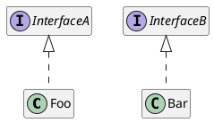

# ioc.java

Minimalistic IOC container for Java applications

## Usage

**Maven Repository**

Add the following maven repository to your pom:

```xml
<repository>
  <id>paul-h.de_repo</id>
  <url>https://mvn.paul-h.de/</url>
</repository>
```

Include the project as dependency:

```xml
<dependency>
  <groupId>de.paulomart</groupId>
  <artifactId>ioc</artifactId>
  <version>3.0.0</version>
</dependency>
```

**Example**



```java

// create a instance of the container
Container container = new Container();

container.registerTransient(Foo.class);
container.registerSingeltion(Bar.class);


// resolves new instance everytime
InterfaceA a1 = container.resolve(InterfaceA.class);
InterfaceA a2 = container.resolve(InterfaceA.class);
// => a1 != a2

// resolves to the same instance everytime
InterfaceB b1 = container.resolve(InterfaceB.class);
InterfaceB b2 = container.resolve(InterfaceB.class);
// => b1 == b2

```

For a more detailed example see the [`src/examples/java`](src/examples/java/) folder.
